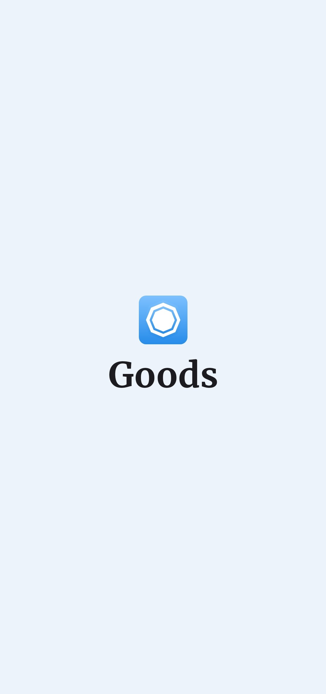
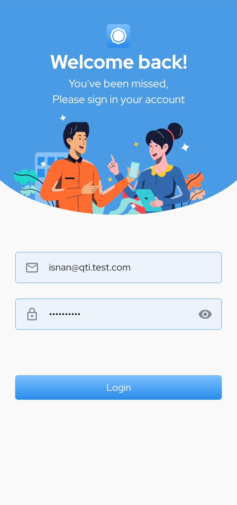
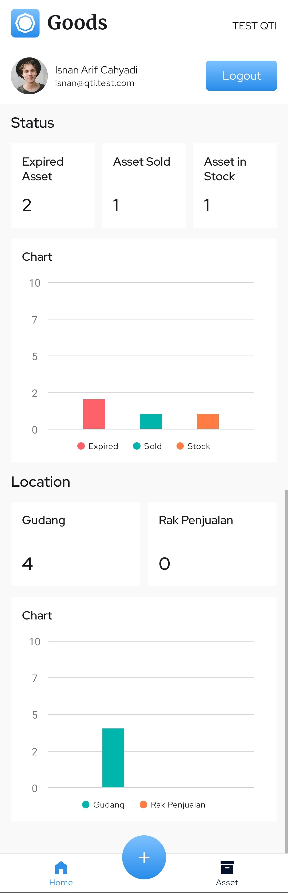
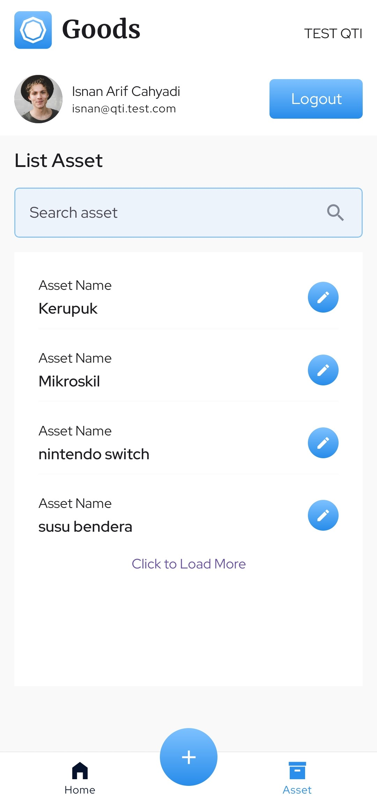
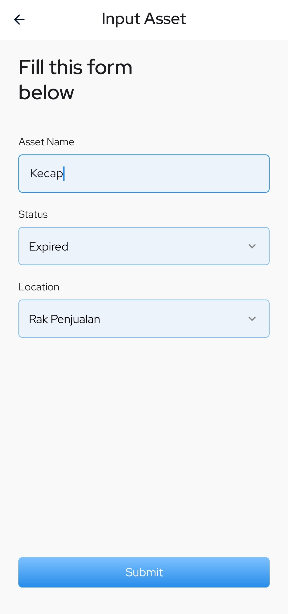
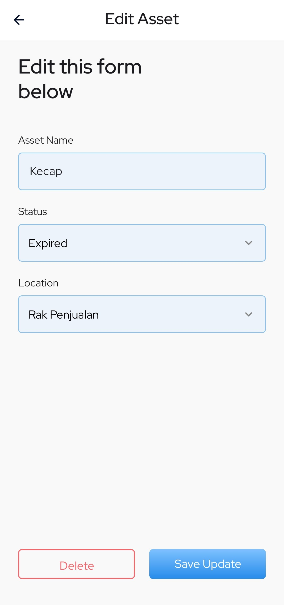

# Asset Management

## Table of Contents

- [Installation and Requirement](#installation-and-requirement)
- [Configuration](#configuration)
- [Build APK](#build-apk)
- [Features](#features)
- [Screenshot](#screenshot)
- [Authors and Contact Info](#authors-and-contact-info)

## Installation and Requirement

This application require min `SDK 21 (Android 5.0 - Loliipop)` for running in device or emulator.

1. Clone this repository to your local machine:

```bash
git clone https://github.com/isnancahyadi/AssetManagement
cd AssetManagement
```

2. Install the required dependencies using npm or yarn:

```bash
npm install
# or
yarn install
```

## Configuration

After installation done, you must create `.env` file in the root directory of the project and add the following environment variable:

```bash
REACT_APP_LOGIN=your_backend_api
REACT_APP_LOGOUT=your_backend_api
REACT_APP_PROFILE=your_backend_api
REACT_APP_GET_ASSET_BY_STATUS=your_backend_api
REACT_APP_GET_ASSET_BY_LOCATION=your_backend_api
REACT_APP_ASSET=your_backend_api
REACT_APP_GET_STATUS=your_backend_api
REACT_APP_GET_LOCATION=your_backend_api
REACT_APP_KEYCHAIN_SERVICE=your_keychain
```

Here you can run project using `npx react-native run-android` command for android or `npx react-native run-ios` for iOS

## Build APK

1. Go to root directory in terminal and run:

```bash
npx react-native bundle --platform android --dev false --entry-file index.js --bundle-output android/app/src/main/assets/index.android.bundle --assets-dest android/app/src/main/res
```

2. Go to android directory:

```bash
cd android
```

3. In this android directory, run this command:

```bash
./gradlew assembleDebug
```

4. You'll find the app in:

`yourProjectDirectory/android/app/build/outputs/apk/debug/app-debug.apk`

## Features

- User Authentication: Allow users to log in and manage assets.
- Asset Analytics: Users can see analytics from asset in home screen.
- Assets Management: Allow users to see asset list, update asset, and delete asset.
- Secure Data Storage: Sensitive data is securely stored using Native Encrypted Storage.
- Responsive Design: The app is designed to work seamlessly on both Android and iOS devices.

## Screenshot

<table>
    <tr>
        <td>1. Splash Screen</td>
        <td>2. Login Screen</td>
        <td>3. Home Screen</td>
    </tr>
    <tr>
        <td>
            
        </td>
        <td>
            
        </td>
        <td>
            
        </td>
    </tr>
    <tr>
        <td>4. List Asset Screen</td>
        <td>5. Input Asset Screen</td>
        <td>6. Edit Asset Screen</td>
    </tr>
    <tr>
        <td>
            
        </td>
        <td>
            
        </td>
        <td>
            
        </td>
    </tr>
</table>

## Authors and Contact Info

For more information about this project or have any question or need help for development, feel free to contact me.

Isnan Arif Cahyadi

<div id="badges">
  <a href="https://www.linkedin.com/in/isnanarifcahyadi/">
    
  </a>
  <a href="mailto:isnan.arifc@gmail.com">
    
  </a>
</div>
